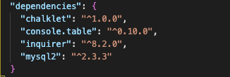
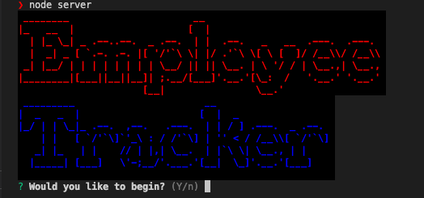
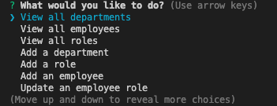
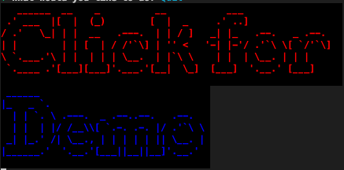
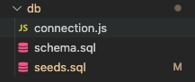
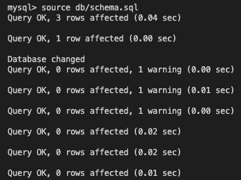
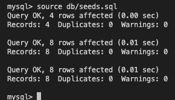

# track-my-employees
          
  ## Description
  This is a command line application that allows you to create and update employees in your database. You can also add new roles with corresponding salaries and ids, as well as new departments for those roles. This app is ran using Node.js and has a handful of dependencies that it requires, most notably the inquirer Node package as well as MySql2. Inquirer is used to ask the user prompts and questions related to the changes to their database. MySql2 is what it uses to create and maintain the database. This app is great for handling your employee database structure and allows you to view your current staff in an effective and concise fashion.
  
  ## Table of Contents
  * [Installation](#installation)
  * [Usage](#usage)
  * [License](#license)
  * [Questions](#questions)
  * [GitHub](#github)
  * [Email](#email)
  
  ## Installation 
  To install my employee tracker, simply clone this repository into your desired directory and run an `npm install` or `npm i` within the terminal. This will ensure that all of the required dependencies get installed into your `package.json` file. I will provide a screenshot of all of the dependencies you will require to ensure you have the correct prerequisites. 

 

 Once you have ensured that you have the correct files and they are downloaded you can go ahead and start the application!
  
  ## Usage 
  To start the application, run `node server` or `node server.js` in your command-line. It will then connect you to your database and begin asking you questions. It will prompt you with a large `Employee Tracker` message and ask if you would like to begin, you can either type `Y` or simply click enter. 
    On all the confirm prompts it will have one of the options `Y/n` (Yes or No) as a capital letter. This means that one is the default and simply hitting enter without typing will select that option.

 

  
  
After you get started you will arrive to what I call the `Home Screen`. This page has all of the commands that you will be able to do when it comes to tracking your database and selecting one and hitting enter will then initiate that process, whatever it may be.

 

Here is a video demo of all the functionality within this app.

 

### DataBase Handling
If you want to change anything about the database, you can navigate to the `db/` directory, within it you will find the `connection.js` file. This is connecting the application to the MySql db. 

 

If you want to manually change the default database entries, you can populate it within the `db/seeds.sql` file. Change the contents then open your MySql2 shell and type the two commands `source db/schema.sql` & `source db/seeds.sql`. This will then change the contents of the default database.

  
 

  ## License
  ### Badges
  
  ### Links to licenses
  https://opensource.org/licenses/MIT

  ## Questions
  If you have any questions, feel free to reach out and contact me via email.
  ### Email
  kieranhan1999@gmail.com
  ### GitHub
  www.github.com/KieranHannagan
  

  